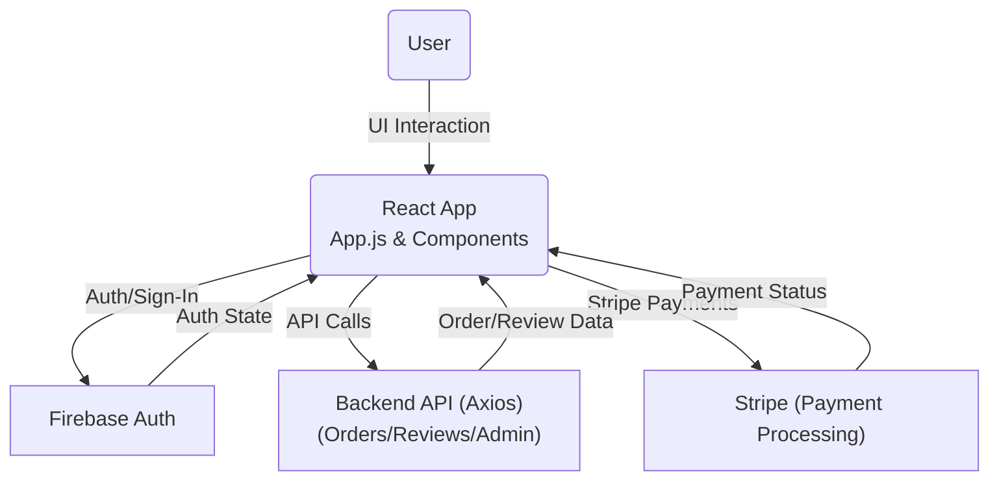

# General Overview of the Easy Consulting Codebase

## Main Technologies

The Easy Consulting application is a modern, single-page web application built using the following core technologies:

- **React**: Utilized as the primary framework for building user interfaces, leveraging component-based architecture for modularity and reusability.
- **React Router**: Handles client-side routing, enabling seamless navigation across multiple pages such as Home, About, Dashboard, and Login without page reloads.
- **Bootstrap & React-Bootstrap**: Applied for responsive layouts and user-friendly UI elements.
- **FontAwesome**: Used for rich iconography, enhancing user experience across forms, navigation, and dashboards.
- **Firebase Authentication**: Integrated for user sign-in/sign-up functionality, enabling both social (Google, Facebook, GitHub) and email/password authentication.
- **Stripe**: Integrated for processing online payments in a secure and user-friendly manner.
- **Axios**: Used for handling HTTP requests to backend endpoints or third-party APIs.
- **React Context API**: Provides application-wide state management for user data, admin status, and currently-selected service, ensuring consistent access and updates throughout the app.

## Project Structure

The codebase is organized within the `Easy-Consulting-react-88412` directory, following modular React conventions. The main directories are:

- `src/`: Main source code folder.
  - `component/`: Houses all React UI components and containers.
    - `Home/`: Components related to the public landing pages (`About`, `Contact`, `Header`, `Pricing`, `Reviews`, `Services`, `Footer`).
    - `Dashoboard/`: Components for the logged-in dashboard, further split into modules such as `AdminDashboard`, `UserDashboard`, `OrderList`, `Sidebar`, `Profile`, and booking/payment flows.
    - `Login/`: Components for user authentication.
    - `Shared/`: Reusable components like the navigation bar (`Navbar`), popover for account actions, spinners, and table orders.
  - `Assets/`: SVGs, images, and graphic assets for branding and illustration.
  - `firebaseBaseConfig.js`: (Expected) Contains Firebase configuration, though currently empty in the codebase.
  - `App.js`: Main application wrapper that sets up routes and context providers.

## Containers and Components

- **Top-Level Context:**
  - The application wraps its contents in a `UserContext` provider, offering access to `user`, `admin`, and `selectedService` globally.

- **Navigation:**
  - `Navbar`: Responsive navigation props based on authentication state. Integrates login and dashboard access and uses `FontAwesome` icons for branding.
  - `Sidebar`: Dashboard sidebar with different links for admin users (e.g., Orders, Add Service, Make Admin, Manage Services) versus regular users (Book, Booking List, Review).

- **Dashboard:**
  - `Dashboard`: Core container checks if the current user is an admin (via a remote call). Renders either the `AdminDashboard` or `UserDashboard` appropriately. Also manages title and sidebar toggle state.
  - `UserDashboard`, `AdminDashboard`: Houses specialized dashboard views. The `Book` component includes service selection and payment (via Stripe).

- **Authentication:**
  - Social sign-in is provided via Google, Facebook, and GitHub using Firebase providers in the `SocialMedia` component. Credential-based login is also implied.

- **Booking and Payments:**
  - `Book` and `Checkout`: Users can select a service to book, view price, and complete payment using Stripe's React components. Payment is processed, and orders are posted to a backend server.
  - Test credit card details are showcased to simulate transactions (e.g., "4242 4242 4242 4242").

- **Reviews:**
  - Users can leave, update, or delete reviews. Review forms leverage React Hook Form for streamlined validation and input management.

## Architectural Highlights

- **State Management:** The React Context API, in combination with local component state, is used in lieu of Redux for lighter-weight, efficient global state management. This provides context-aware features (e.g., switching dashboards if the user is an admin).
- **API Integration:** Significant use of Axios for communication with external endpoints (for orders, reviews, admin checks), highlighting a decoupled frontend/backend design. The backend is assumed to be accessed at URLs resembling `https://immense-river-40491.herokuapp.com/...`.
- **Role-Based UI:** UI adapts based on role (admin/non-admin) both in navigation elements and dashboard capabilities.
- **Component Reuse:** Shared folder holds universally-used UI widgets and elements, minimizing duplication.
- **Third-Party Integrations:** Stripe is used for payment processing with appropriate React Stripe components, and Firebase providers are leveraged for modern, secure authentication workflows.
- **Styling and Responsiveness:** Styles are modularized into corresponding CSS files per component, and responsive behaviors are handled for navigation and layout.

## Notable Integrations

- **Stripe:** Payment accepted securely for consulting services using React Stripe.js with clear state handling for submission and feedback.
- **Firebase:** Authentication is handled using Firebase's social providers, making use of both SDK compat and the newer provider objects.
- **SweetAlert & React-Hot-Toast:** Used extensively to provide user feedback for actions (errors, successes, loading states).
- **FontAwesome:** Rich icon integration for navigation, status, and feedback.

## Deployment & Testing

- Project includes scripts for local development and build via Yarn, as highlighted in the README. The codebase follows standard Create React App conventions.

---

### Mermaid Diagram: High-Level Architecture

---

## Summary

The Easy Consulting codebase demonstrates a well-structured React application, integrating industry-standard tools for authentication, payment, and UI/UX. Its context-based state management, role-based navigation, and modular architecture make it a maintainable and extensible foundation for online consulting services.

---

**Sources**:
- `src/App.js`
- `src/component/Login/SocialMedia.jsx`
- `src/component/Shared/Navbar/Navbar.jsx`
- `src/component/Home/Services/Service.jsx`
- `src/component/Dashoboard/Dashboard/Dashboard.jsx`
- `src/component/Dashoboard/Sidebar/Sidebar.jsx`
- `src/component/Dashoboard/UserDashboard/Book/Book.jsx`
- `src/component/Dashoboard/UserDashboard/Book/Checkout.jsx`
- `src/component/Dashoboard/UserDashboard/AddReview/Review.jsx`
- `src/component/Dashoboard/UserDashboard/AddReview/ReviewFrom.jsx`
- `README.md`
